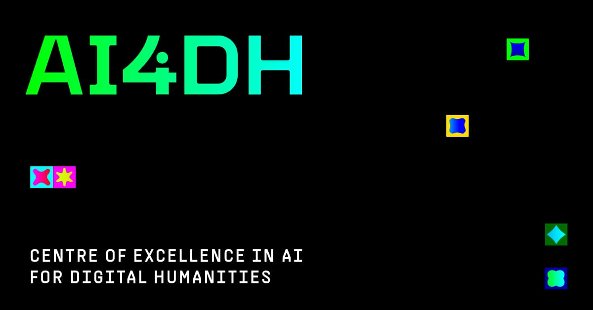

This repository contains the code associated with the LLM4DH T2.3 Advanced grammatical analysis of multilingual corpora.
More concretely, the data/scripts needed to run the baseline model (without additional knowledge) and the 
Universal Dependencies RAG-based agent with code generation.

# Acknowledgements
The work was supported by the Slovene Research and Innovation Agency (ARIS) project GC-0002 and also by the core 
research programme P6-0411. The work was also supported by EU through ERA Chair grant no. 101186647 (AI4DH) and
cofinancing for research innovation projects in support of green transition and digitalisation (project PoVeJMo, 
no. C3.K8.IB). The computational resources were provided by SLING through project S24O01-42.

  

